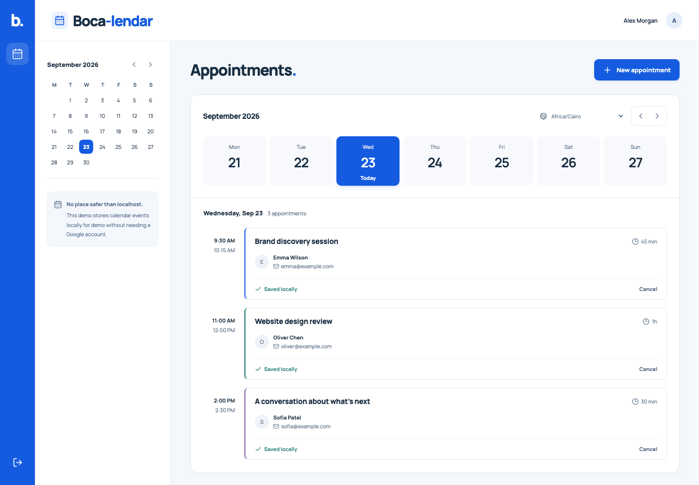

# Boca-lendar

An appointment booking app built with Laravel 13, Inertia 2, React 19, TypeScript and PostgreSQL 17. Every booking is saved locally, with optional Google Calendar sync.



## Run locally

Requires PHP 8.4+ with `pdo_pgsql`, Composer 2, Node.js 22.13+ and Docker Compose. Only PostgreSQL runs in Docker.

```sh
cp .env.example .env
composer install
npm ci
docker compose up -d --wait
php artisan key:generate
php artisan migrate --seed
php artisan dev
```

Open **http://127.0.0.1:2017**. Port `2017` is a nod to [Boca Pro's founding year](https://www.linkedin.com/company/boca-pro/about/#:~:text=Founded-,2017,-Locations%20(1)). Register or use `demo@example.com` / `schedule-demo`. The seed includes fictional appointments; Google is optional.

`php artisan dev` starts Laravel on port `2017`, Vite, the queue worker, scheduler and log viewer together. Stop them with Ctrl+C. `docker compose stop` stops PostgreSQL while preserving its data. PostgreSQL uses port `55432`; change `DB_PORT` in `.env` if needed.

## Google Calendar

1. Create a Google Cloud project and enable **Google Calendar API**.
2. In **Google Auth Platform**, configure Branding, choose **External / Testing**, and add your Google account under **Audience > Test users**.
3. Under **Data Access**, add `openid`, `userinfo.email`, `userinfo.profile`, `calendar.calendarlist.readonly` and `calendar.events`. All except `openid` use the `https://www.googleapis.com/auth/` prefix.
4. Create a **Web application** OAuth client. Set its authorized redirect to `http://127.0.0.1:2017/calendar/google/callback` and add its credentials to `.env`:

```dotenv
APP_URL=http://127.0.0.1:2017
GOOGLE_CLIENT_ID=your-client-id
GOOGLE_CLIENT_SECRET=your-client-secret
GOOGLE_REDIRECT_URI=http://127.0.0.1:2017/calendar/google/callback
```

Run `php artisan config:clear`, restart `php artisan dev`, then click **Connect Google** and accept both calendar permissions. Keep credentials outside Git. The browser address, app URL and authorized callback must use the same hostname and port.

All appointments live in PostgreSQL, regardless of where they were created. Connecting imports the current calendar year; after that, [Google sync tokens](https://developers.google.com/workspace/calendar/api/guides/sync) bring in new, changed or deleted appointments. Browsing dates reads the database without contacting Google. Recurring and all-day appointments are supported.

`php artisan calendar:sync` runs every minute. **Refresh appointments** queues the same job for the visible calendars. `php artisan dev` runs the scheduler and queue worker. The sidebar checkboxes control which calendars are shown.

**New appointment** and **Edit appointment** share one form. Customer name and email are required on save, including when editing an import that lacks them. Choose a Google calendar when booking, or use **Sync to Google** on an existing local appointment. Edits and cancellations save locally first, then sync to Google. Failed delivery keeps your changes and offers a retry. Read-only calendars can be viewed but not changed.

Cancelled appointments remain below active ones. Editing or cancelling a recurring appointment affects that occurrence only. **Upcoming Events** lists the next three saved appointments across all months; selecting one opens its day.

Testing mode only permits listed test users and [expires refresh tokens after seven days](https://developers.google.com/identity/protocols/oauth2#expiration). Reconnect the same Google account when needed. Reviewers can use their own Cloud project or be added as test users to an existing one.

## Decisions and edge cases

Inertia keeps routing, authentication and validation in Laravel. React handles the workspace. [Actions](app/Actions) contain booking rules, the [sync job](app/Jobs/SyncAppointment.php) handles delivery, and the [Google adapter](app/Calendar/GoogleCalendar.php) sits behind a provider interface so tests can simulate failures.

| Concern | Approach and reason |
| --- | --- |
| Concurrent bookings | A PostgreSQL exclusion constraint prevents overlapping app reservations on the same calendar, even across users. Before a booking, edit or local-to-Google sync, the app also checks known imported Google events. A calendar row lock serializes those checks with an import in progress. Adjacent appointments are allowed. |
| Duplicate requests or jobs | Request keys prevent duplicate bookings. Stable Google event IDs and ownership markers make retries safe; row locks serialize sync and cancellation. |
| Slow or unavailable Google | Save the booking and sync intent together, then deliver through a database queue. Calls have timeouts, transient failures retry up to five attempts, and the scheduler recovers pending work. Failures remain visible without losing the booking. |
| Incoming Google changes | One sync token per calendar and one row per event. Changes and the next token commit together after all pages succeed. Failed syncs keep existing data; overlapping jobs share one request. Expired tokens rebuild the imported range, and year rollover includes the new year. |
| Editing | Reuse booking validation and conflict protection. Stale forms cannot overwrite newer edits. Google writes use [Google version checks](https://developers.google.com/workspace/calendar/api/guides/version-resources) and partial updates to preserve descriptions, guests and other event details. Customer fields round-trip through private event metadata. |
| Cancellation | Local bookings release their slot immediately. Google bookings keep it reserved until removal is confirmed; cancelled imports also block new bookings until Google confirms removal. Deleting in Google cancels the linked booking and releases its slot on refresh. Missing events are checked individually, including calendar access, so moved events and permission failures do not count as deletions. |
| Timezones and past dates | Store UTC instants plus the booking's IANA timezone. Reject past times and DST gaps; ambiguous times require an explicit UTC choice. Overnight bookings appear on both dates. |
| Credentials and access | Encrypt Google tokens, keep them out of browser props, and scope bookings to their owner. OAuth uses state, PKCE and a ten-minute expiry. Preserve `APP_KEY` when moving an existing database. |

Outgoing changes hold row locks during Google calls to keep cancellation ordering straightforward. At higher traffic, I'd replace that with leases and version checks to avoid holding database transactions during network requests.

## Tests

PHP, React and desktop/mobile browser tests cover the application. Coverage gates require 100% PHP application lines and 100% frontend statements, branches, functions and lines. The frontend entry point is exercised by browser tests rather than unit coverage.

```sh
composer test
npm test

# PHP coverage requires Xdebug or PCOV.
XDEBUG_MODE=coverage composer test:coverage
npm run test:coverage

npm run build
npx playwright install chromium
npm run test:e2e
```

Tests cover database races, duplicate delivery, Google failures, OAuth, timezones, expired forms, event pagination, expired sync tokens, stale responses and deletion permissions. Browser tests cover desktop/mobile flows and accessibility. Google calls are faked; live event viewing and create/cancel sync were also verified on September 23, 2026.

PHP tests use `boca_test`. Playwright recreates `boca_e2e` and starts a server on port `8011`. Docker provisions both databases separately from the app's `boca` database. [CI](.github/workflows/checks.yml) also checks formatting, builds and dependency advisories.

## Scope

Conflict protection covers Boca-lendar reservations and known imported Google events. Imports preserve existing overlaps between Google events. A Google event created or moved after the last sync can still conflict with a new booking. With more time, I would check live Google availability before saving and recheck before delivery, then show a conflict for a newly occupied slot. Google changes also update linked Boca-lendar bookings; conflicting moves are reported instead of silently double-booking.

Each user can connect one Google account. Creating recurring appointments, invitations, reminders, password resets and email verification are outside this assessment. With more time, I would model recurring series and occurrence exceptions, queue idempotent invitation and reminder delivery, and add Laravel's password broker and email verification flows.

## Made with <3 by Michael x Codex

Codex assisted Michael Yousrie with implementation, UI, tests and documentation. The [frontend-design skill](https://openskills.cc/skills/anthropics-skills-frontend-design) helped shape the visual direction.
